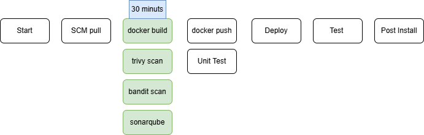

# GitHub Actions GitOps example

A Flask app with Prometheus metrics, built and scanned by [ci.yaml](.github/workflows/ci.yaml).

1. **Build and scan, in parallel (30 min max):** docker build, Semgrep, Trivy, Bandit, SonarQube (mock)
2. **Then, in parallel:** push to Docker Hub (mock) and unit tests
3. **Deploy** by committing to the GitOps repo, then test and post-install (all mocks)

Run locally: `pip install -r requirements.txt && python app.py`, then open http://localhost:8000.
